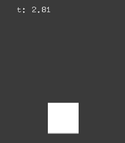
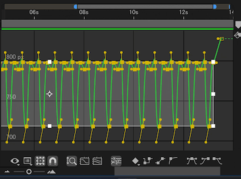
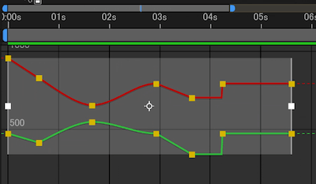
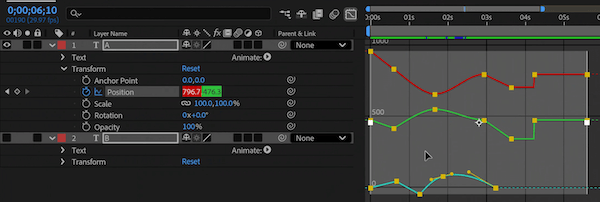
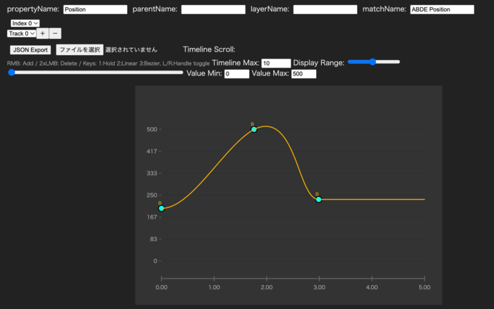

# ofxAEEasingLoader



After Effects easings loader for openFrameworks.

You can load selected keyframes (curves/easings) from After Effects.

Tested on oF 0.12.0

## Usage (AE)

1. Select curves (easings) or keyframes which you want to export



2. Export it by using [tools/exportSelectedEasing.jsx](tools/exportSelectedEasing.jsx) on File > Script > Execute menu.

## Example1: single value

```cpp
#include "ofxAEEasingLoader.h"

ofxAEEasingLoader ae_easing;

void ofApp::setup(){
    ae_easing.load("test.json");
}

void ofApp::draw(){
    float t = std::fmodf(ofGetElapsedTimef(), 14.0f);
    float y = ae_easing.get<float>(t);

    // NOTE:
    // - you can also specify property name: `ae_easing.get(t, "prop name")`
    //    - property name also matches match_name.
    // - alternatively, specify property index: `ae_easing.get(t, 0)` ( `.get(t)` is short for `.get(t, 0)` )

    ofDrawBitmapString("t: " + ofToString(t, 2), 50, 50);

    ofDrawRectangle(100, y - 600, 50, 50);
}
```

see [example/src/ofApp.cpp](example/src/ofApp.cpp) or [example/src/ofApp.h](example/src/ofApp.h) for detail.

## Example2: multiple value

Situation that multiple values exported (in this case, X and Y).



```cpp
#include "ofxAEEasingLoader.h"

ofxAEEasingLoader ae_easing;

void ofApp::setup(){
    ae_easing.load("test2.json");
}

void ofApp::draw(){
    float t = std::fmodf(ofGetElapsedTimef(), 6.0f);
    ofVec2f p = ae_easing.get<ofVec2f>(t);

    // NOTE:
    // - you can also use vector: `ae_easing.get<vector<float>>(t)`
    // - if values count are among 2~4, you can use ofVec2f, ofVec3f, ofVec4f.
    // - if exceeds it, you should use vector.

    ofDrawBitmapString("t: " + ofToString(t, 2), 50, 50);

    ofDrawRectangle(p.x - 400, p.y - 100, 50, 50);
}
```

see [example2/src/ofApp.cpp](example2/src/ofApp.cpp) or [example2/src/ofApp.h](example2/src/ofApp.h) for detail.

## Example3: multiple tracks

Situation that multiple values of multiple tracks exported (in this case, X and Y in Layer "A", Rotation in Layer "B").



```cpp
#include "ofxAEEasingLoader.h"

ofxAEEasingLoader ae_easing;

size_t property_index1;
size_t property_index2;

void ofApp::setup(){
    ae_easing.load("test3.json");
    ae_easing.dumpTracks();
    
    //  dumpTracks() shows:
    //    [notice ] ------------
    //    [notice ] property_name: 'Position'
    //    [notice ] layer_name: 'A'
    //    [notice ] parent_name: 'Transform'
    //    [notice ] ( match_name: 'ADBE Position' )
    //    [notice ] ------------
    //    [notice ] property_name: 'Rotation'
    //    [notice ] layer_name: 'B'
    //    [notice ] parent_name: 'Transform'
    //    [notice ] ( match_name: 'ADBE Rotate Z' )

    property_index1 = ae_easing.getPropertyIndex("Position", "A");
    property_index2 = ae_easing.getPropertyIndex("Rotation", "B");
    
//    ofSetRectMode(OF_RECTMODE_CENTER);
}

void ofApp::draw(){
    float t = std::fmodf(ofGetElapsedTimef(), 6.0f);
    ofVec2f p = ae_easing.get<ofVec2f>(t, property_index1);
    float deg = ae_easing.get<float>(t, property_index2);

    // NOTE:
    // - you can also write directly: `.get(t, property_name, layer_name, [parent_name])`

    ofDrawBitmapString("t: " + ofToString(t, 2), 50, 50);

    ofDrawRectangle(p.x - 400, p.y - 100, 50, 50);
    
    ofPushStyle();
    ofSetColor(255, 0, 0);
    ofTranslate(200, 50);
    ofRotateDeg(deg);
    ofDrawRectangle(0, 0, 200, 50);
    ofPopStyle();
}
```

see [example3/src/ofApp.cpp](example3/src/ofApp.cpp) or [example3/src/ofApp.h](example2/src/ofApp.h) for detail.

## Notes

- :warning: Bezier calculation function was generated by GitHub Copilot. While already checked ([#1](https://github.com/funatsufumiya/ofxAEEasingLoader/pull/1)), but please use with care.
- Property name (and parent name) is localized by your language setting of AE. We recommend to use English (for example, on Windows, put `ae_force_english.txt` on Documents folder.)
  - Please not that `property_name` matches both property_name (localized) and match_name. 

## Appendix: json editor

[Simple p5.js json file editor](https://funatsufumiya.github.io/ofxAEEasingLoader/editor/) (works on web browser): source: [`./docs/editor`](./docs/editor/).

:warning: Almost created by GitHub Copilot. Please use with care.



## License

[0BSD](./LICENSE_0BSD) or [WTFPL](./LICENSE_WTFPL)
